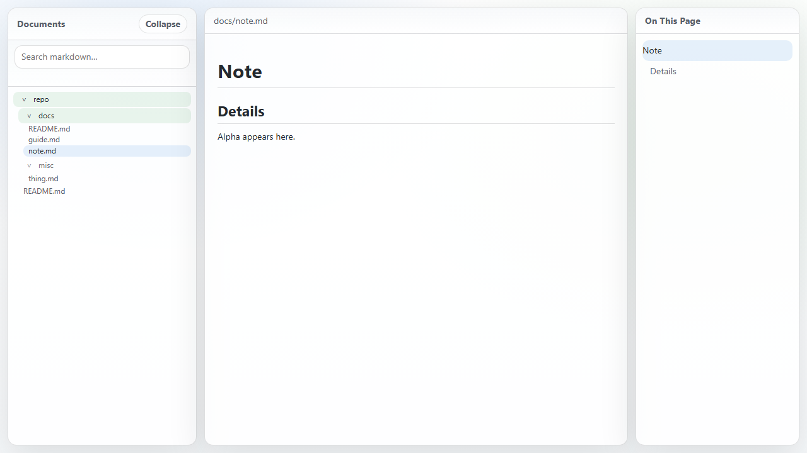
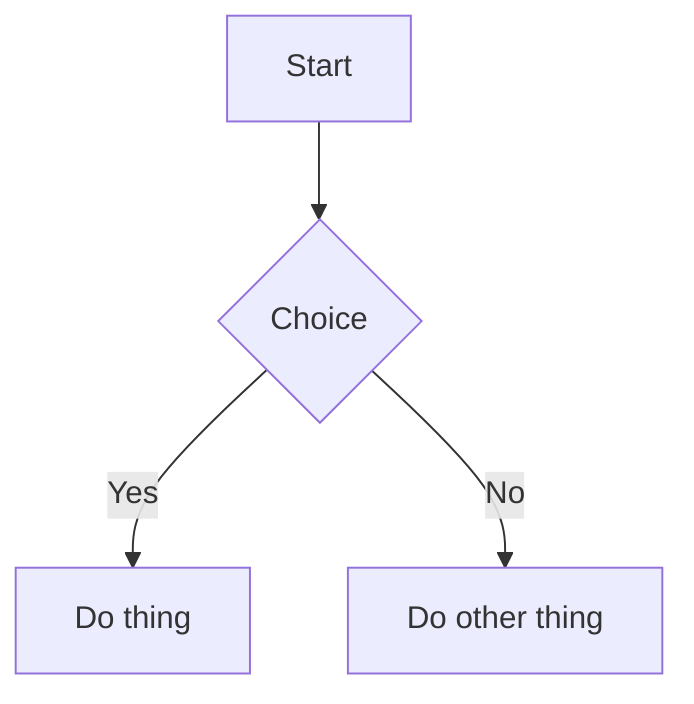

[](https://github.com/albahrani/repobook/actions/workflows/ci.yml)
[](https://github.com/albahrani/repobook/releases)
[](LICENSE)

Turn any folder (typically a Git repository) into a fast, navigable Markdown "book" on `localhost`.

[Features](#features) • [Install](#install) • [Usage](#usage) • [Mermaid](#mermaid-diagrams) • [Security](#security) • [Contributing](#development--contributing)



## Features

- File tree navigation, breadcrumbs, and per-document table-of-contents
- GitHub-flavored-ish Markdown rendering with syntax highlighting
- Optional full-text search powered by ripgrep (`rg`)
- Mermaid diagram blocks via fenced code blocks with language `mermaid`
- Safe-by-default when browsing untrusted repos (sanitized HTML + separate-origin assets)
- Single binary with embedded assets (no frontend build step)

## Install

Releases first (recommended)

1) Download the archive for your platform from:
   https://github.com/albahrani/repobook/releases
2) Extract it and run `repobook` (or `repobook.exe` on Windows).

Build from source (Go required)

```bash
go build ./cmd/repobook
```

Optional: install ripgrep for search

- Debian/Ubuntu: `sudo apt install ripgrep`
- macOS (Homebrew): `brew install ripgrep`

## Usage

Serve a folder/repo:

```bash
repobook --no-open /path/to/repo
```

Common options:

```bash
repobook --host 127.0.0.1 --port 32123 --no-open /path/to/repo
```

By default repobook binds to `127.0.0.1` and chooses an available port.

## Mermaid diagrams

Write fenced code blocks with the `mermaid` language:

````markdown

````

repobook converts these blocks into `<div class="mermaid">...</div>` and loads the Mermaid runtime in the browser (vendored fallback to CDN).

## Development & Contributing

See `CONTRIBUTING.md` for contribution guidelines.

Run Go tests:

```bash
go test ./...
```

Run UI tests (Playwright):

```bash
npm ci
npx playwright install --with-deps
npm run test:ui
```

Formatting / vet:

```bash
gofmt -l $(git ls-files '*.go')
go vet ./...
```

## Security

- Repo assets are served from a separate origin to avoid same-origin issues.
- Markdown is sanitized after rendering.

## Links

- [Issues](https://github.com/albahrani/repobook/issues)
- [Security](SECURITY.md)
- [Third-party notices](THIRD_PARTY_NOTICES.md)

## License

MIT. See `LICENSE`.
