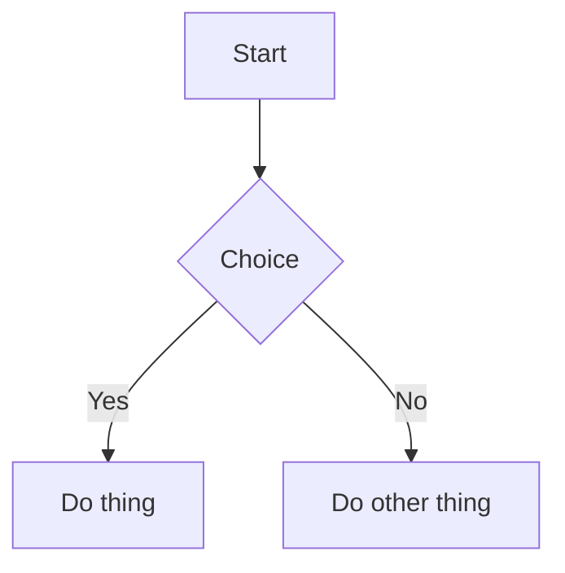

# repobook

[](https://github.com/albahrani/repobook/actions/workflows/ci.yml)

Links:

- Issues: https://github.com/albahrani/repobook/issues
- Contributing: `CONTRIBUTING.md`
- Security: `SECURITY.md`
- License: `LICENSE`
- Third-party notices: `THIRD_PARTY_NOTICES.md`

repobook is a small local web app that turns a folder (typically a Git repo) into a fast, navigable Markdown "book":

- File tree navigation + breadcrumbs
- Table of contents for the current document
- GitHub-flavored-ish Markdown rendering
- Syntax highlighting for fenced code blocks
- Optional full-text search via ripgrep (`rg`)
- Mermaid diagrams (```mermaid fences)

It runs a local HTTP server and serves a single-page frontend from embedded static assets.

## Quick Start

Requirements:

- Go (see `go.mod` for the current version)
- Optional: ripgrep (`rg`) for search

Run from source:

```bash
go run ./cmd/repobook --no-open /path/to/repo
```

By default it binds to `127.0.0.1` and chooses an available port.

Common options:

```bash
go run ./cmd/repobook --host 127.0.0.1 --port 32123 --no-open /path/to/repo
```

## Mermaid Diagrams

Mermaid diagrams are supported by writing fenced code blocks with the `mermaid` language:

```markdown

```

repobook converts these blocks into `<div class="mermaid">...</div>` and loads the Mermaid runtime in the browser.

- Preferred: vendored Mermaid at `internal/web/static/vendor/mermaid.min.js` (works offline / in CI)
- Fallback: CDN (unpkg) if the vendored file is missing

## Development

Run Go tests:

```bash
go test ./...
```

Run UI tests (Playwright):

```bash
npm ci
npx playwright install --with-deps
npm run test:ui
```

## License

MIT. See `LICENSE`.

Third-party notices: `THIRD_PARTY_NOTICES.md`.
