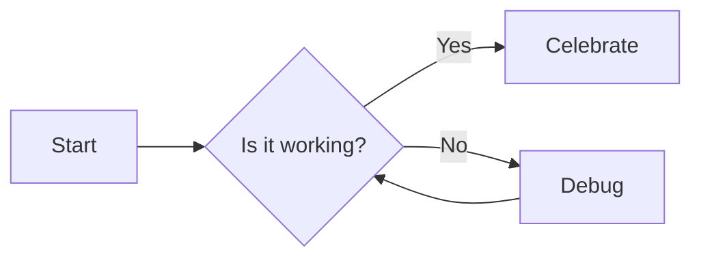

# Guide

## Part 1

See [Note](note.md#details).

```go
package main

import "fmt"

func main() {
  fmt.Println("hello")
}
```


## Part 2

More text.

## Diagram

Here is a sample Mermaid diagram (flowchart):


